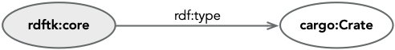
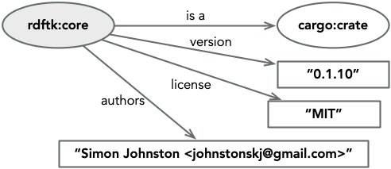
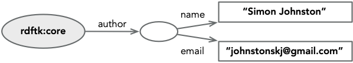
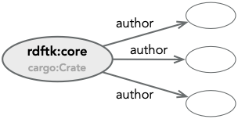
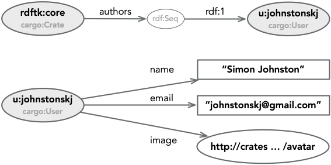

# RDF Primer

RDF is a data model for describing things in a manner that allows for open extension, easy merging of data, built on 
the same concepts as the web itself and which allows for the inference of facts from those asserted. This data model 
is abstract in the sense that it is described entirely based upon its semantics and not on its syntax. Multiple 
serialization forms, representations, are described for RDF data but none describe RDF itself. 

This brief primer introduces enough to get started on understanding the RDFtk set of crates and more details will be
introduced in crate-specific sections. There is a more complete [W3C RDF Primer](https://www.w3.org/TR/rdf-primer/) 
that has a lot more information than presented here.

## Resources, Statements, and Literals

The data model for RDF is surprisingly simple, the core component of which is the **Statement**. A statement asserts
a fact based on the linguistic form *subject* *predicate* *object* (Property is sometimes used instead of the more
formal predicate). Examples might be:

* *Simon* *authored* *this*
* <<https://github.com/johnstonskj/rust-rdftk.git>> *is-a* *repository*
* <<http://crates.io/crates/rdftk_core>> *description* "The core data model."

1. The **Subject** of a statement is a **Resource** which is either addressed with an [IRI](https://tools.ietf.org/html/rfc3987)
(Internationalized Resource Identifiers), or an internally generated identifier commonly known as a **Blank Node**.
1. The **Predicate** is some relationship between the subject and object and is always an IRI. 
1. The **Object** of a statement is either a resource or a **Literal**. In the case of a resource the same details apply as
for the subject. 
1. A **Literal** is a string value that may have an associated **Language** *or* **Data Type** but not both.
   1. The language will be expressed as an ISO language identifier, "en", "en_us", etc.
   1. The data type will be expressed as an IRI usually to one of the defined [XML Schema Data Types](https://www.w3.org/TR/xmlschema-2/)
      or a type expressed in XML Schema.

Due to the three parts in each statement a statement may be referred to as a **Triple**.

A set of statements is a **Graph**, 

### Visually

It is common in RDF documents to see diagrams representing a statement such as that below. The predicate will be shown 
as a directed, and annotated, arrow from subject to object. This is similar to Chen's notation for [entity–relationship 
modeling](http://bit.csc.lsu.edu/~chen/pdf/Chen_Pioneers.pdf), and as such demonstrates RDF's natural style in describing
data.

It is important to note that all predicates are directional implying that a bi-directional, or **Symmetric** relationship 
requires two predicates -- see [Vocabulary Descriptions](#vocabulary-descriptions) below.

<a name="fig_1_2"></a>
<div class="caption figure">1.2: An RDF Statement</div>

To visually distinguish between named resources, blank nodes, and literals, the following conventions will be used.

1. Named resources will be shown as large ovals, their inner name is some short form of the resource's IRI.
1. Blank nodes will be shown as small ovals usually with no inner name (as they are effectively anonymous).
1. Literals will be shown as rectangles; their content may, or may not, be shown in double quotes.

<a name="fig_1_3"></a>
<div class="caption figure">1.3: Statement Node Types</div>

## An Annotated Example

As a simple, and easy to approach, example let us consider the `Cargo.toml` file for the core crate. This is a set of 
facts stated about a Cargo crate, and we will work up to an RDF representation of it.

```toml
[package]
name = "rdftk_core"
version = "0.1.10"
authors = ["Simon Johnston <johnstonskj@gmail.com>"]
edition = "2018"
description = "The core data model."
documentation = "https://docs.rs/rdftk_core/"
repository = "https://github.com/johnstonskj/rust-rdftk.git"
license = "MIT"
readme = "README.md"
publish = true

[dependencies]
error-chain = "0.12.2"
unique_id = "0.1.3"
rdftk_iri = { version = "0.1.2", path = "../rdftk_iri" }
rdftk_names = { version = "0.1.5", path = "../rdftk_names" }
```

First, let's start with a single statement, we will assert that a resource, identified as `rdftk:core`, is related to 
a resource, identified as `cargo:crate`, with the relationship `rdf:type`. The astute reader will notice that these
names appear to be namespaced, `type` in the namespace `rdf` for example, and this is true. Namespaces, or vocabularies, 
are described below. Note, the shading of the subject node in this case is simply to anchor the examples, it has no 
additional meaning.

<a name="fig_1_4"></a>
<div class="caption figure">1.4: A Statement</div>

Given this simple start we can begin adding other attributes from the *package* section of the file. These additional
properties are literal values, so they have been drawn as rectangles. In this primer we will always show literal values
in quotes, this is not necessary but adds clarity.

<a name="fig_1_5"></a>
<div class="caption figure">1.5: Properties as Statements</div>

When we get to the attribute `publish` however we want to express that this is a boolean value and not just a string. 
To do this we add a data type from the XML Schema Datatypes (XSD) standard to the literal value, as shown below.

<a name="fig_1_6"></a>
<div class="caption figure">1.6: Typing a Property</div>

This kind of type annotation can also be applied to a resource, if that resource has an `rdf:type` predicate, thus 
saving an arrow in the diagram. The different forms of annotation can be seen in the following figure. As it is common 
to not show the identifier for a blank node the annotation is the only value shown.

<a name="fig_1_7"></a>
<div class="caption figure">1.7: Type Annotations</div>

Sometimes we want to have a resource with multiple predicates, but without the strong identity of an IRI. To do this 
we use blank nodes, nodes that have an internally generated, and therefore not externally addressable, identity. For
example, we could choose to break up the string value for the `authors` property into separate name and email, but don't 
want to give this representation an IRI.

<a name="fig_1_8"></a>
<div class="caption figure">1.8: An Anonymous Subject</div>

However, the actual attribute `authors` is a TOML list, and we have just added a single predicate relationship. In RDF
it is perfectly reasonable, and frankly quite common, to simply allow multiple predicate instances. 

<a name="fig_1_9"></a>
<div class="caption figure">1.9: Multiple Predicate Values</div>

However, what is the semantic meaning of this? are these all authors, is there implied ordering? To this end RDF has
a number of collection structures, **List**, **Seq**uence, **Alt**ernatives, and **Bag** that model linked lists,
ordered lists, a list of alternatives, and an unordered collection. For a good description of RDF collections, see the 
blog post [Ordered Data in RDF](https://ontola.io/blog/ordered-data-in-rdf/).

For our example, we choose to model the `authors` attribute as an RDF sequence, the sequence itself is a blank node 
containing other blank nodes from the previous author example.

<a name="fig_1_10"></a>
<div class="caption figure">1.10: Collections</div>

Finally, the real power of the RDF data model is that both subject and object can be resources, and in particular named
resources, and we can therefore link statements via these. For example; let us assume that the `crates.io` site also
describes users in RDF, now we can model our author predicate to *either* a blank node as shown above, or a named
user by using their IRI. In this example the two sub-graphs are managed by different services but the ubiquitous use
of the IRI as an identifier means the two are inherently linked.

<a name="fig_1_11"></a>
<div class="caption figure">1.11: Linking Statements</div>

This is an important consideration as RDF adheres to the [*Open-World Assumption*](https://en.wikipedia.org/wiki/Open-world_assumption)
the implication of which is that the same IRI may be the subject of a sub-graph elsewhere, and that the graphs may in
fact contradict each other.

## Vocabulary Descriptions

While the term *Schema* is often used in conjunction with RDF the term is problematic for software folks as it has
unfortunate connotations. For exaample, a database schema restricts the data that exists within its tables, a class in 
a programming language restricts the shape of instances. In both of these cases the schema has a closed-world assumption
that it can validate the shape of things and that no things exists outside of schema control.

### Common Vocabularies

* [RDF](https://www.w3.org/TR/rdf11-concepts/) itself
* [RDF Schema](https://www.w3.org/TR/rdf-schema/)
* [XML Schema Datatypes](https://www.w3.org/TR/xmlschema-2/)
* [OWL](https://www.w3.org/TR/owl2-overview/)
* [Dublin Core](https://www.dublincore.org/specifications/dublin-core/)
* [SKOS](https://www.w3.org/TR/skos-reference/)

### Example Vocabulary Mapping

| Section | Attribute | Predicate | Restriction |
| ------- | ----- | -------- | -----------
| package | name  | `dcterms:identifier` | |
|         | version | `semver:version` | |
|         | authors | `dcterms:contributor` | multiples |
|         | author/name | `foaf:name` | |
|         | author/email | `foaf:mbox` | |
|         | author/image | `foaf:depiction` | |
|         | edition | `cargo:edition` | |
|         | description | `dcterms:description` | |
|         | documentation | `crate:documentation` | |
|         | repository    | `crate:repository` | |
|         | license | `dcterms:license` | |
|         | readme  | `cargo:readme` | |
|         | publish | `cargo:publish` | |
| features | | `dcterms:has_part` | blank node |
|          | *name* | `dcterms:identifier` | |
|          | *parts* | `dcterms:requires` | `rdf:Bag` |
| dependencies | | `dcterms:requires` | blank node |
|              | *name* | `dcterms:references` or `dcterms:identifier` | |
|              | version | `semver:matches` |
|              | path | `cargo:path` |

In the table above we used two new namespaces `cargo:`, and `semver:`, the following listing is the RDF Schema for 
the Cargo vocabulary we have introduced so far. Note that while we assert that the new entity `cargo:Crate` is **a** 
(the value `a` in this representation is a shortcut for the property `rdf:type`) `rdfs:Class` we do not make assertions 
about the type of the remaining entities. This is where the RDF entailment comes in, the predicates `rdfs:domain` and
`rdfs:range` both have an assertion that `rdfs:domain` is `rdfs:Property` and therefore `edition` to `readme` must be
properties.

```turtle
@prefix rdf: <http://www.w3.org/1999/02/22-rdf-syntax-ns#> .
@prefix rdfs: <http://www.w3.org/2000/01/rdf-schema#> .
@prefix xsd: <http://www.w3.org/2001/XMLSchema#> .
@prefix dcterms: <http://purl.org/dc/terms/> .
@prefix cargo: <http://crates.io/rdf/cargo#> .

<http://crates.io/rdf/cargo#>
    # Properties about the vocabulary itself.
    dcterms:issued      "2020-12-02"^^<http://www.w3.org/2001/XMLSchema#date> ;
    dcterms:title       "Cargo crate vocabulary."@en .

cargo:Crate
    a                   rdfs:Class ;
    rdfs:isDefinedBy    <http://crates.io/rdf/crates#> ;
    rdfs:label          "A Crate resource"@en .

cargo:edition
    rdfs:isDefinedBy    <http://crates.io/rdf/crates#> ;
    rdfs:label          "Rust Edition"@en ;
    rdfs:domain         cargo:Crate ;
    rdfs:range          xsd:gYear .

cargo:documentation
    rdfs:isDefinedBy    <http://crates.io/rdf/crates#> ;
    rdfs:label          "URL for documentation."@en ;
    rdfs:domain         cargo:Crate ;
    rdfs:range          rdfs:Resource .

cargo:repository
    rdfs:isDefinedBy    <http://crates.io/rdf/crates#> ;
    rdfs:label          "URL for source repository."@en ;
    rdfs:domain         cargo:Crate ;
    rdfs:range          rdfs:Resource .

cargo:localPath
    rdfs:isDefinedBy    <http://crates.io/rdf/crates#> ;
    rdfs:label          "Local path for dependency resolution."@en ;
    rdfs:domain         cargo:Crate ;
    rdfs:range          rdfs:Literal .

cargo:publish
    rdfs:isDefinedBy    <http://crates.io/rdf/crates#> ;
    rdfs:label          "Whether to publish this crate."@en ;
    rdfs:domain         cargo:Crate ;
    rdfs:range          xsd:boolean .

cargo:readme
    rdfs:isDefinedBy    <http://crates.io/rdf/crates#> ;
    rdfs:label          "Path, relative to crate root, for a readme resource."@en ;
    rdfs:domain         cargo:Crate ;
    rdfs:range          rdfs:Literal .
```

## Output Serialization

Here is the complete version of the RDF representation of our crate's metadata. Note that we do not have a type asserted
for the subject which can be implied to be `cargo:Crate` given that it is the `rdfs:domain` of some of the asserted
properties.

```turtle
@prefix rdf: <http://www.w3.org/1999/02/22-rdf-syntax-ns#> .
@prefix xsd: <http://www.w3.org/2001/XMLSchema#> .
@prefix dcterms: <http://purl.org/dc/terms/> .
@prefix foaf: <http://xmlns.com/foaf/0.1/> .
@prefix cargo: <http://crates.io/rdf/cargo#> .
@prefix semver: <http://crates.io/rdf/semver#> .

<http://crates.io/crates/rdftk_core>
    dcterms:identifier  "rdftk_core" ;
    dcterms:version     "0.1.10" ;
    dcterms:contributor [
        foaf:name       "Simon Johnston" ;
        foaf:mbox       "johnstonskj@gmail.com" ;
        foaf:depiction  <http://crates.io/u/johnstonskj/avatar>
    ] ;
    cargo:edition       "2018"^^xsd:gYear ;
    dcterms:description "The core data model." ;
    cargo:documentation <https://docs.rs/rdftk_core/> ;
    cargo:repository    <https://github.com/johnstonskj/rust-rdftk.git> ;
    dcterms:license     "MIT" ;
    cargo:readme        "README.md" ;
    cargo:publish       "true"^^xsd:boolean ;
    dcterms:requires    [
        rdf:type        rdf:Bag ;
        rdf:_1          [
            dcterms:references  <http://crates.io/crates/error-chain> ;
            semver:matches      "0.12.2"
        ] ;
        rdf:_2          [
            dcterms:references  <http://crates.io/crates/unique_id> ;
            semver:matches      "0.1.3"
        ] ;
        rdf:_3          [
            dcterms:references  <http://crates.io/crates/rdftk_iri> ;
            semver:matches      "0.1.2" ;
            cargo:localPath     "../rdftk_iri"
        ] ;
        rdf:_4          [
            dcterms:identifier  "rdftk_names" ;
            semver:matches      "0.1.5" ;
            cargo:localPath     "../rdftk_names"
        ]
    ] 
.
```

## Query

## Extensions

### Quads

### RDF*